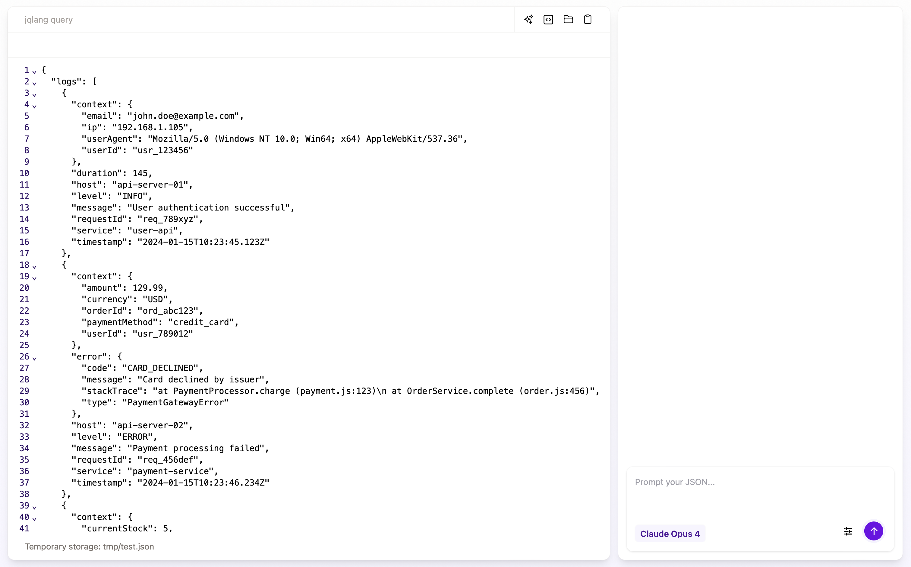

# jsonkit



**Tech 💻**

Tauri, React, TypeScript, Go, Anthropic API, jq (gojq), CodeMirror, TanStack Router/Query

**Description 📖**

A desktop app for working with JSON through conversation.

Paste in some JSON and chat with an AI agent that can actually query and transform it — under the hood it writes jq expressions and runs them against your data via a tool call, so answers come from the real document rather than a guess. A Go backend wraps the Anthropic SDK and the gojq engine, while the Tauri + React client gives you a CodeMirror editor for the JSON and a markdown chat view for the conversation.

**Future work 🕥**

Support multiple JSON sources and saved chat history. Add export of the generated jq queries so they can be reused outside the app, and explore streaming responses for faster feedback on large payloads.

## Project structure

This is a [Turborepo](https://turborepo.com/) monorepo:

- `apps/client` — Tauri + React desktop client (Vite, TanStack Router/Query, CodeMirror, Tiptap)
- `apps/backend` — Go API wrapping the Anthropic SDK and the `gojq` engine

## Develop

```sh
pnpm install
pnpm dev          # run all apps via turbo
pnpm tauri:dev    # run the desktop client
```

The Go backend lives in `apps/backend`; run it from that directory with `go run .`.
